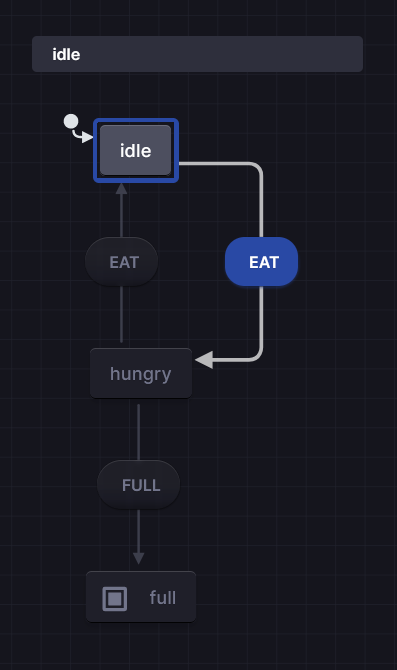

# Application of Cryptic State Machines

## by Nnamdi Michael Okpala.

### Introduction:

Within the realm of automata theory, there are two main types of state machine.A state machine is an abstract machine that move from one state to another till it get to the end.

1) Behavioural State Machine:
   A Behavioural State Machine is one that is conserend  of/within a system.A system is a collection of components working together. This is useful when modelling determinstic behaviour such as a:  game states.

2) Protocol State Machine:
   This state machine is conserned with **events**, amd is determinsitic by nature as it transition for one event to another. This is useful when modelling networking protocol which are event driven.

3) Cryptic State Machine:
   A cryptic state machine is a state machine which on encountering  the same **state** yield a different **transistions**. Unlike a typical **behavioural state** machine is determinstic by nature yielding the same **transistion** for the same **state**.This is a useful concepts as it is derived by how cryptic language works.The means a cryptic state machine has loops.. By definition,A cryptic language has one obvious meaning which can be derived very easily,and another meaning which is harder to understand/ parse contextually. 
   for example:
   
   - "I never said she stole my money" has seven different meanings depending on the stressed word.
     This can be used to create a cryptic service in which a cryptic(modelled from a cryptic state machine) algorithm runs given a given state machine.

### Diagram for a Cryptic State Machine

A hungry individual who will still remain **hungry** in the state **hungry** state until their have eaten enough entering a **full** state.This hungry state could  be two or more times meaning the NFA-to-DFA of a cryptic state machine would contains cyclic loops to the node itself for this given instance.A cyclic state diagram is non-determinstic.

The cryptic state machine can be examplified as using the state machine diagrams:

